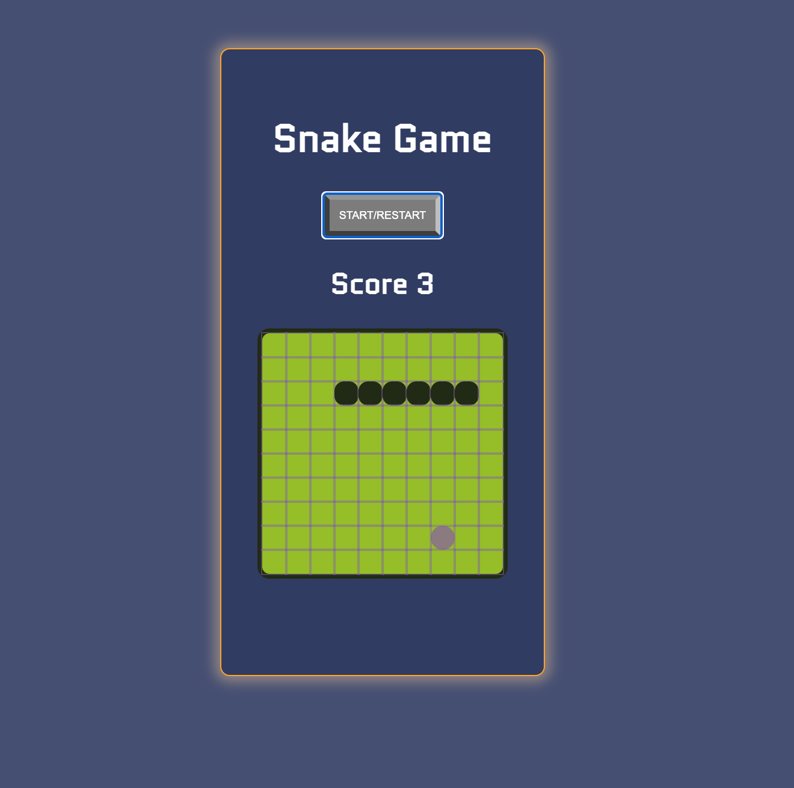

# Nokia Snake Game

> Created a website with Vanilla Javascript, HTML and CSS on which you can play basic snake (for desktop) like some of use used to on our old Nokia phones.
>
> [Live Demo](https://stefi.codes/Nokia3310-Snake/)



## How it works

In order to play click on the Start/Pause button and move the snke by using the arrow keys. The goal is to collect the blinking shapes and to grow. As you grow you will move faster.

## Technologies

Javascript, HTML and CSS.

## Why I've build this game?

I've followed the tutorial by [Ania Kubów](https://twitter.com/ania_kubow) as part of a [Scrimba course](https://scrimba.com/learn/snakegame).

Decided to build this game in order to practice manipulating the DOM by using pure JS and also doing some extra CSS stuff. By building such small games with a tutor I get to see how they code and learn from them.


## Install and Play

```
git clone https://github.com/stefi23/Nokia3310-Snake
open the index.html
play
```
